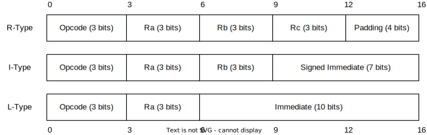

# The Iridium Computer Assembler

## Introduction

The Iridium Assembler is based on an instruction set documented [here](https://user.eng.umd.edu/~blj/RiSC/RiSC-isa.pdf) by Professor Bruce Jacob for his series of lectures on Digital Computer Design at the University of Maryland in Fall 2000, many thanks to him.

The instruction set architecture (ISA) works off of 16-bit instructions and a word-size of 2 bytes, with 64kb (2^16) of memory locations of 16 bits each. There are 8 registers labelled *\$zero* and *\$r0-\$r6*, each addressed with 3 bits. The register *$zero* is read-only and always contains the value 0.

The ISA used is a RISC architecture with only 8 instructions and 4 pseudo-instructions outlined later in this file. This is enough to ensure that the ISA is Turing-complete, with a few helpful utilities.

## Instructions

Instructions fall into 3 categories: RRR-type, RRI-type, and RI-type, which are formatted as follows:



The instruction set is laid out in the table below:

| Mnem | Opcode | Format    | Example             | Description                       |
|------|--------|-----------|---------------------|-----------------------------------|
| ADD  | 000    | RRR-Type  | ADD $r0, $r1, $r2   | Ra = Rb + Rc                      |
| ADDI | 001    | RRI-Type  | ADDI $r0, $zero, 27 | Ra = Rb + Imm                     |
| NAND | 010    | RRR-Type  | NAND $r0, $r0, $r1  | Ra = ¬(Rb & Rc)                   |
| LUI  | 011    | RI-Type   | LUI $r0, 0x1DE      | Bits 7-10 of Ra = Imm             |
| SW   | 100    | RRI-Type  | SW $r0, $r1, 50     | Value of RAM at Rb + Imm = Ra     |
| LW   | 101    | RRI-Type  | LW $r0, $r1, .loc   | Ra = value of RAM at Rb + Imm     |
| BEQ  | 110    | RRR-Type  | BEQ $r0, $r1, $r2   | If Ra == Rb, branch to addr in Rc |
| JAL  | 111    | RRI-Type* | JAL $r7, $r1        | Branch to addr in Rb, Ra = PC + 1 |

*The immediate in the JAL instruction is 0x007F under normal circumstances, or the syscall code if a syscall (see [Syscalls & Interrupts](#syscalls--interrupts)).

### Formatting and Validating Instructions

The general formal for a line of assembly code is:

`label:<whitespace>opcode<whitespace>field0, field1, field2<whilespace> #comments`

These can be validated using some regular expressions for each of the instruction formats:
```
RRR-Type: ^([a-zA-Z]+:)?([[:blank:]]*)(ADD|NAND|BEQ)[[:blank:]]+(((\$(zero|r[0-6])),)([[:blank:]]*))(((\$(zero|r[0-6])),)([[:blank:]]*))(\$(zero|r[0-6]))([[:blank:]]*)(#([[:blank:]]*)[[:print:]]+)?$

RRI-Type: ^([a-zA-Z]+:)?([[:blank:]]*)(ADDI|SW|LW|JAL)[[:blank:]]+(((\$r[0-6]),)[[:blank:]]*)(((\$(zero|r[0-6])),)[[:blank:]]*)(0*((-|\+)?[0-9]+|0b[01]+|0x[[:xdigit:]]+))[[:blank:]]*(#[[:blank:]]*[[:print:]]+)?$

RI-Type: ^([a-zA-Z]+:)?([[:blank:]]*)LUI[[:blank:]]*(((\$(zero|r[0-6])),)[[:blank:]]*)(0*([0-9]+|0b[01]+|0x[[:xdigit:]]+))[[:blank:]]*(#[[:blank:]]*[[:print:]]+)?$
```

Further constraints on the instructions are that the 7 bit immediates cannot be outside the range -64 to 63, and the 10 bit immediates cannot be outside the range 0 to 0x03FF or 0 to 1023.

We also must take the format of the immediates into account as they may be in decimal form with no prefix, in binary form with the 0b prefix, or in hex form with the 0x prefix, and ensure that these are also in the range.


### Syscalls & Interrupts

Syscalls are made by writing the instruction `.syscall [code]` in the same way as a normal instruction. This will be substituted by the assembler with a `JAL` command to a location in the OS section of RAM to invoke the relevant subroutine called the Interrupt Handler. The value stored in **$r6** will by taken as an argument for this if one is required, and will be where the result is returned. When an interrupt is detected, registers *\$r0* to *\$r5* will be pushed to the stack and restored afterwards. The available syscall instructions are as follows:

| Code | Name           | Description                                                           |
|------|----------------|-----------------------------------------------------------------------|
| 0    | Print char     | Outputs the value in **$r6** as a character                           |
| 1    | Print string   | Outputs the string starting at the address stored in **$r6**          |
| 2    | Print decimal  | Outputs the value in **$r6** as a decimal integer                     |
| 3    | Print hex      | Outputs the value in **$r6** as a hex integer                         |
| 4    | Input int      | Awaits input from the user in decimal format and stores it in **$r6** |
| 5    | Input char     | Awaits input from the user as a character and stores it in **$r6**    |
| 6    | Halt           | Stops execution and freezes                                           |
| 7    | Error          | Stops execution, outputs **ERROR**, and freezes                       |


## Pseudo-Instructions

The program may also contain the following directives for the assembler:
 - **NOP**: the processor does nothing this cycle, and is replaced by the instruction `ADD $zero $zero $zero` which clearly does nothing but takes 1 cycle to do.
 - **LLI**: formatted as `LLI $Ra Imm` ORs the 6-bit immediate operand into the register $Ra and is replaced by `ADD $rX, imm6` upon compilation. This is useful when used in combination with LUI to load a full 16 bit value into a register.
 - **MOVI**: formatted as `MOVI $Ra, Imm`, MOVI is shorthand for LUI + LLI and takes a 16-bit operand and puts it into the specified register. This instruction assembles to 2 instructions, and can therefore confuse jumping to numerical addresses, so labels should be used if at all possible.
 - **.fill**: formatted as `.fill Imm` tells the assembler to place a 16-bit immediate value here instead of an instruction. If it is used with a label address instead of an immediate, such as `.fill end`, then the address of the label will be inserted. It can also take a character in the form `'char'`, such as `'a'` and converts it to its ASCII representation.
 - **.space**: formatted as `.space Imm [Values]`, it is replaced by a number of `.fill` instructions equal to the immediate operand which fills the locations with the value in Values at that index, and 0x0000 if index > len(values).
 - **.text**: formatted as `.text "some string"`, it does the same as `.space` except converts each character in the string to its ASCII representation and uses those as the values to insert plus a null terminator **\0** to insert into a .space the same length as the string + 1.

These are each validated differently:
-  `NOP` is simply required to match the regex `^([[:blank:]]*)([a-zA-Z]+:)?([[:blank:]]*)NOP([[:blank:]]*)(#[[:print:]]*)?$`.
-  `LLI` should match the regex `^([[:blank:]]*)([a-zA-Z]+:)?([[:blank:]]*)LLI([[:blank:]]*)(\$r[0-6]),([[:blank:]]*)(0*((\+|-)?[0-9]+|0b[01]+|0x[[:xdigit:]]+))([[:blank:]]*)(#[[:print:]]*)?$` and have an immediate between 0 and 63.
-  `MOVI` should match the regex `^([[:blank:]]*)([a-zA-Z]+:)?(?1)(MOVI)(?1)(\$r[0-6]),(?1)(0*((-|\+)?[0-9]+|0b[01]+|0x[[:xdigit:]]+))(?1)(#[[:print:]]*)?$` and have an immediate between -32,768 and 32,767.
-  `.fill` should match the regex `^([[:blank:]]*)([a-zA-Z]+:)?(?1).fill(?1)((0*((-|\+)?[0-9]+|0b[01]+|0x[[:xdigit:]]+))|'[[:ascii:]]')(?1)(#[[:print:]]*)?$` and have any non-character immediate be between -32,768 and 32,767.
-  `.space` should match the regex `^([[:blank:]]*)([a-zA-Z]+:)(?1).space(?1)(0*([0-9]+|0b[01]+|0x[[:xdigit:]]+))(?1)\[(('[[:ascii:]]'|(0*((-|\+)?[0-9]+|0b[01]+|0x[[:xdigit:]]+))),(?1))*\](?1)(#[[:print:]]*)?$` and have any non-character immediate be between -32,768 and 32,767 and have the size of the space be >= the size of the array.
-  `.text` should match the regex `^([[:blank:]]*)([a-zA-Z]+:)(?1).text(?1)(?1)"([[:ascii:]]+)"(?1)(#[[:print:]]*)?$`


## Labels

Labels are notes in the assembly code at the start of an instruction which mark locations which can be referenced elsewhere in other instructions using the '@' prefix. These are useful as they allow the programmer to reference locations in memory without knowing where they are beforehand as many factors can cause this to happen. It is encouraged for programmers to use labels and not absolute addresses wherever possible. 

Usually, labels are used with the MOVI pseudoinstruction in place of the immediate operand (the absolute value is substituted in during assembly), then, that register can be used as the argument to a LW or JAL instruction to load data or branch execution. When used with an RRI instruction or the LLI pseudo-instruction, the bottom 6 bits of the address the label refers to are inserted into the immediate field; when used with the LUI or other RI instruction, the top 10 bits are loaded into the immediate field.

The code below demonstrates loading the value from a `.fill` instruction using a label into *$r0* and then printing is as a hex number:
```
my_data: .fill 0x0ABC
MOVI $r0, @my_data
syscall 3
```

The code below demonstrates how labels can be used in a simple loop to count to 20.
```
ADDI $r0, $zero, 0 # current count
ADDI $r1, $zero, 20 # maximum

loop: ADDI $r0, $r0, 1
      MOVI $r6, @end
      BEQ $r0, $r1, $r6
      MOVI $r6, @loop
      JAL $zero, $r6

end: syscall 6
```


## Process of Assembly

The assembly code will be processed in 3 passes of the input file:
 1. **Read Phase**: The file is scanned and turned into a vector of lines.
 2. **Validation Phase**: The vector has each line validated and the programmer is informed if any invalid code is detected.
 3. **Label Table Phase**: Any labels are found and inserted into a table of the name of the label and the location in memory it refers to.
 4. **Label Substitution Phase** Labels are changed to their proper values using the table from the previous phase.
 5. **Pseudo Phase**: Any pseudo-instructions and syscalls are found and the appropriate substitutions are made.
 6. **Binary Generation Phase** The final vector of lines in converted into binary and written to the output file. 


## Notes

In order to subtract numbers, the programmer should flip the bits of the value to subtract and add 1. Flipping the bits can be done by NANDing the value with itself and adding 1 by using the ADDI instruction. 

Multiplication can be achieved by repeated addition, bit-testing, and left-shifting by 1 (the same as doubling).


## Current State of Development

 - [x] Opening and reading input file to generate vector of lines
 - [x] Validating lines vector
   - [x] Validating RRR-Type instructions
   - [x] Validating RRI-Type instructions
   - [x] Validating RI-Type instructions
   - [x] Validating instruction pseudo-instructions
   - [x] Validating data pseudo-instructions
   - [x] Validating syscalls
 - [x] Pseudo-Instruction substitution
   - [x] Find pseudo-instructions in the vector
   - [x] Determine correct substitution(s) to make
   - [x] Make substitutions
 - [x] Label table generation
   - [x] Find all labels
   - [x] Generate table of names and locations of labels
 - [ ] Label substitution
   - [ ] Find all references to labels in the vector
   - [ ] Make substitution if the address will fit in the space allowed for the immediate
   - [ ] Make substitution for pseudo-instructions
 - [ ] Convert instructions to binary
 - [ ] Write final binary to file 
